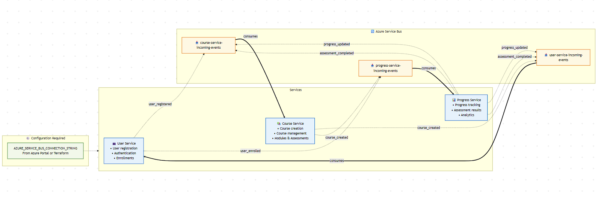

# Online Learning Management System - Solution Design

## 1. Functional Requirements

### Core Functionality
- **User Management**: Students and instructors can register, login, and manage their profiles
- **Course Management**: Instructors can create courses with modules and assessments
- **Enrollment System**: Students can enroll in courses and view available content
- **Progress Tracking**: System tracks student progress through course materials
- **Assessment System**: Students can take assessments and receive scores
- **Certificate Generation**: Automatic certificate issuance upon course completion
- **Analytics Dashboard**: Progress analytics for both students and instructors

### User Roles
- **Students**: Can enroll in courses, view content, take assessments, track progress
- **Instructors**: Can create courses, manage content, view student progress, grade assessments
- **System**: Automated progress tracking, certificate generation, analytics

### Key Features
- Course enrollment with real-time progress updates
- Interactive assessments with immediate feedback
- Comprehensive analytics and reporting
- Secure data handling with encryption
- Real-time notifications via message queues
- Caching for improved performance

## 2. Non-Functional Requirements

### Performance Requirements
- **Response Time**: All API calls must respond within 2 seconds under normal load
- **Throughput**: System must support 1000 concurrent users
- **Scalability**: Horizontal scaling capability using microservices architecture
- **Availability**: 99.9% uptime with proper fault tolerance

### Security Requirements
- **Data Encryption**: All PII data encrypted at rest and in transit
- **Authentication**: JWT-based authentication with secure token management
- **Authorization**: Role-based access control for different user types
- **HTTPS**: All communications over secure channels

### Reliability Requirements
- **Data Backup**: Regular automated backups of all databases
- **Fault Tolerance**: Service redundancy and graceful degradation
- **Error Handling**: Comprehensive error logging and monitoring
- **Recovery**: Quick recovery procedures for service failures

### Maintainability Requirements
- **Code Quality**: Clean, well-documented code with 60%+ test coverage
- **Monitoring**: Comprehensive logging and metrics collection
- **CI/CD**: Automated build, test, and deployment pipelines
- **Documentation**: Complete API documentation and deployment guides

## 3. Services Communication Diagram

## 4. Database Schema Diagram

## 5. System Architecture Overview

## 6. Message Flow Diagram

## 7. Security Architecture

